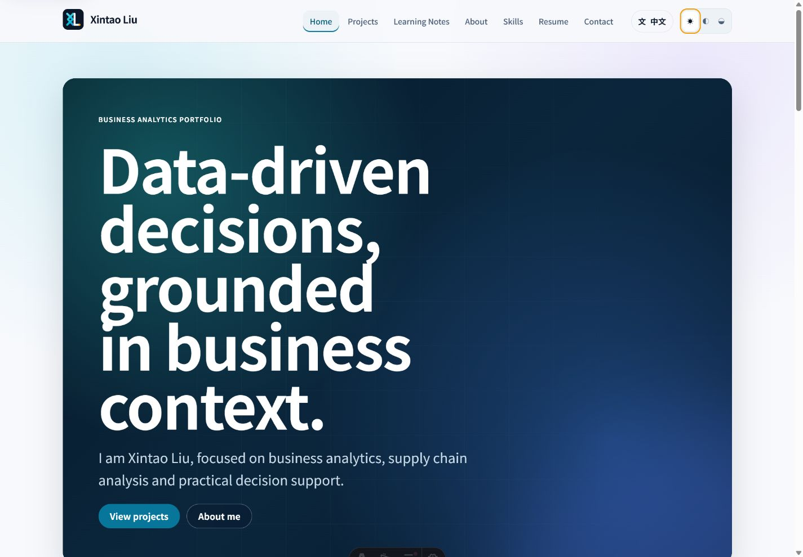
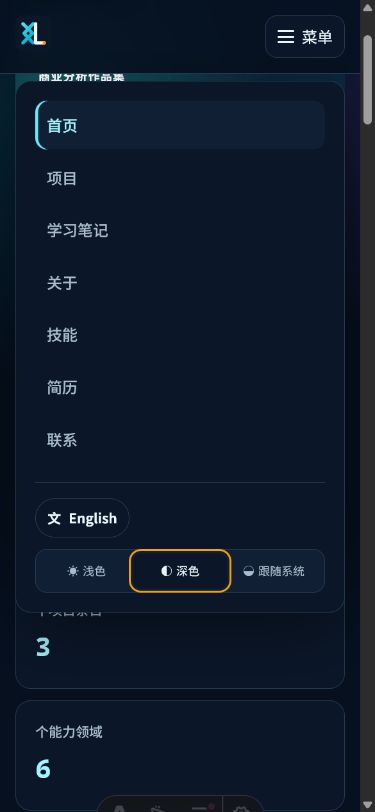
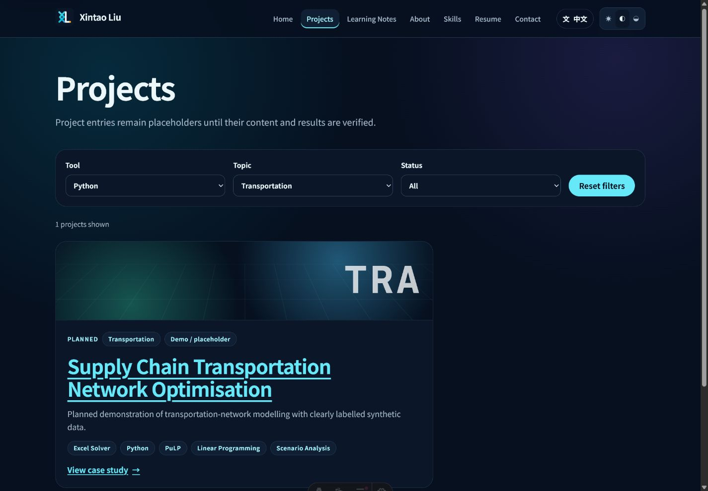
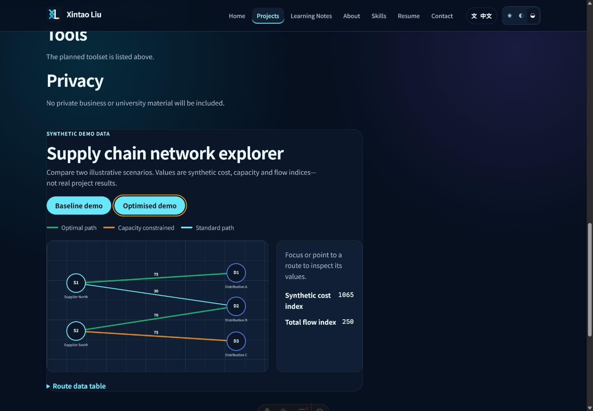

# Final Local Review

## 1. 阶段状态与本地提交

| 阶段                               | 状态 | Commit    |
| ---------------------------------- | ---- | --------- |
| Phase 3：页面与双语内容框架        | 完成 | `f3c620b` |
| Phase 4：多背景 Hero               | 完成 | `b369547` |
| Phase 5：项目系统与供应链网络      | 完成 | `adb7bab` |
| Phase 6：动画与页面过渡            | 完成 | `0037693` |
| Phase 7：SEO、性能、可访问性与安全 | 完成 | `f6aa26f` |
| Phase 8：部署准备                  | 完成 | `feaec80` |

浏览器验收后另有修复提交 `36c3ff2`，用于确保 Astro 客户端页面切换后继续保持主题偏好。

## 2. 最终质量检查

使用锁文件重新安装并验收：

| 命令                   | 结果                                      |
| ---------------------- | ----------------------------------------- |
| `npm ci`               | PASS（388 packages，0 vulnerabilities）   |
| `npm run format:check` | PASS                                      |
| `npm run check`        | PASS（78 files，0 errors/warnings/hints） |
| `npm run lint`         | PASS                                      |
| `npm run test`         | PASS（11 tests；敏感信息扫描通过）        |
| `npm run build`        | PASS（28 pages；构建产物校验通过）        |
| `npm audit`            | PASS（0 vulnerabilities）                 |

## 3. 已实现功能

- 完整的英文默认站点与 `/zh/` 中文站点；主要路由包括 `/`、`/about/`、`/skills/`、`/projects/`、`/projects/[slug]/`、`/notes/`、`/notes/[slug]/`、`/resume/`、`/contact/` 及对应中文路由。内容集合以 `translationKey + locale` 配对，缺少翻译时回退目标语言首页。
- Light、Dark、System 三态主题可保存偏好、响应系统变化，并在刷新和客户端页面切换后保持；桌面与移动导航、语言切换、键盘焦点和 Escape 关闭菜单均通过检查。
- Hero 支持 Aurora、图片、视频和 Network 四种互斥模式，由集中配置选择。当前默认 Aurora；图片使用本地可替换占位素材，视频源为空时安全回退 poster，Network canvas 会按可见性和动效偏好暂停。
- 项目页支持 Tool、Topic、Status 组合筛选并同步 URL。供应链组件使用明确标记的合成 demo 数据，支持基准/优化情景、最优/受限路线、成本/运量/容量展示、键盘可聚焦路线及数据表。
- 已实现客户端页面过渡、滚动显现、时间线、计数、卡片微倾斜和阅读进度；`prefers-reduced-motion` 下禁用或简化非必要动画。
- 已配置 canonical、hreflang、sitemap、robots、Open Graph/Twitter、Person/WebSite/CreativeWork JSON-LD、404、内部链接与构建检查、敏感信息扫描。占位或草稿详情页为 `noindex`，且不进入 sitemap。
- `.github/workflows/deploy.yml`、Dependabot、GitHub Pages 操作说明及 GitHub Free 迁移说明均已准备；未实际启用或运行部署。

## 4. 浏览器验收与截图

桌面、390px 手机宽度均无横向滚动；中英文导航、筛选、供应链交互和主题状态正常。测试设备启用 reduced motion 时，页面内容保持可见且无视频自动播放。控制台未发现应用错误。

## 5. 尚缺资料与已知限制

仍需用户后续提供或确认：正式中文姓名、职业照片/头像、正式图片和视频、公开职业邮箱、LinkedIn、双语简历、教育与实习的准确机构/日期/职责，以及可公开项目的真实数据来源、方法、结果、报告、仓库或仪表板链接。当前未虚构上述信息，相关入口已隐藏或标为占位、Planned、In Development、Demo。

已知限制：默认仅启用 Aurora；尚无正式 Hero 视频；项目和笔记详情仍是占位草稿；社交分享图为本地 SVG 占位；本轮完成浏览器功能与响应式检查，但未执行带评分的 Lighthouse 审计。GitHub Pages 仍需用户日后明确授权并在仓库设置中启用。

## 6. Git 与发布状态

- 当前分支：`main`
- 本报告提交后工作区：clean
- Git remote：不存在
- Push / 实际部署 / 域名绑定 / 付费服务：均未执行
- `PROJECT_BRIEF.md`、`PROJECT_PLAN.md`、`CODEX_AUTONOMOUS_EXECUTION_POLICY.md`：未修改
- 阻塞问题：无
